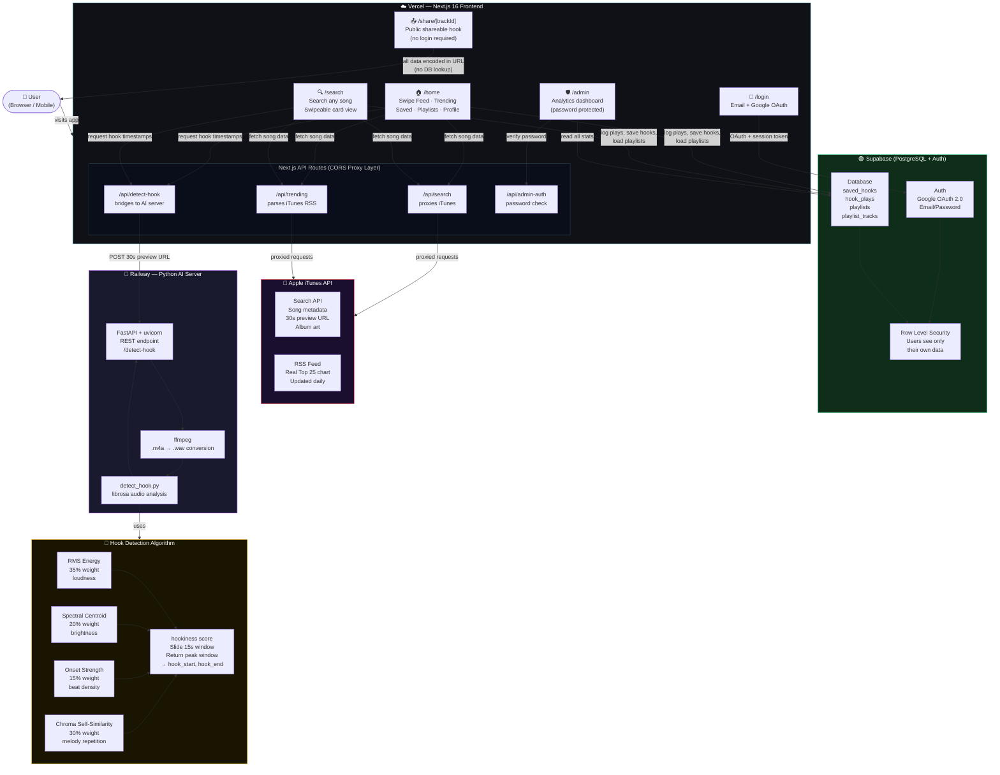

# 🐘 Hookify

<div align="center">


### *"just the hook. 15 seconds. the best part."*

[](https://hookify-app-chi.vercel.app)
[](https://github.com/shreyagoyal9/hookify-app)
[](https://web-production-c2177.up.railway.app/docs)
[](https://nextjs.org)
[](https://supabase.com)

</div>

---

## 🎯 The Idea

You open Spotify. A 3-minute song plays. You wait... skip ahead... wait some more... for that **one moment** — the hook — the 15 seconds that made you love the song in the first place.

**Hookify skips straight to it.**

It's a TikTok-style music app that plays only the catchiest part of any song, detected automatically by a custom AI model built from scratch using Python and librosa.

---

## ✨ Features

### 🎵 Core
- **AI Hook Detection** — custom Python/librosa model finds the hook of any song automatically
- **TikTok-style swipe feed** — swipe left/right to move between trending hooks
- **Spinning vinyl** — animated vinyl record with real album art from iTunes
- **Real 30s audio previews** — plays the exact hook section, not the full song
- **Loop mode** — tap to loop the hook on repeat 🔁
- **Play/pause via elephant** — tap the mascot in the top-right to control playback

### 🔍 Search
- Search any song or artist from iTunes' full catalogue
- AI detects hook timestamps in the background for each result
- Full card view with single-finger swipe gestures (up = next, down = back)
- Search history — recent searches saved locally as tappable chips
- Clear all history with one tap

### 🔥 Trending
- Pulls **real iTunes top 25 chart data** updated daily (no API key needed)
- Medal rankings: 🥇🥈🥉 for top 3
- Tap any charting song to jump straight to its hook in the feed

### 👤 Profile
- Listening stats: saves, total plays, playlists created
- **Top artists bar chart** — see which artists you play most
- **Listener level badge** — Hook Newbie → Explorer → Fan → Addict, based on play count
- Member since date

### ❤️ Saved Hooks
- Heart any hook to save it permanently
- Play/pause saved hooks directly from the saved tab
- Remove saved hooks instantly

### 🎵 Playlists
- Create unlimited playlists
- Add any hook from the feed, search results, or saved collection
- **Search and add songs directly inside a playlist** — with a preview button to hear before adding
- Remove songs with 🗑️
- Play all — plays every hook back-to-back automatically
- Delete playlists

### 📤 Share
- Every hook generates a unique `/share/[trackId]` link
- The share page works without login — anyone can preview the hook and open Hookify
- Uses native share sheet on mobile, copies link to clipboard on desktop

### 🐘 Onboarding
- First-time users see a welcome screen explaining how Hookify works
- Dismisses with one tap, never shows again

### 📊 Admin Dashboard
- Password-protected at `/admin`
- Real-time stats: total users, plays, saves, playlists
- Top 5 most played songs
- Recent play log with timestamps and user emails
- Full user list with per-user stats

---

## 🧠 How the AI Works

The hook detector is a **custom audio analysis model** — no pre-trained ML, built from scratch.

```
iTunes preview URL (30s .m4a)
        ↓
  Download audio
        ↓
  Convert to WAV (ffmpeg)
        ↓
  Extract audio features (librosa):
    • RMS Energy            → loudness / intensity at each moment
    • Spectral Centroid     → brightness / melody content
    • Onset Strength        → rhythmic / beat activity
    • Chroma Self-similarity → melody repetition (hooks repeat!)
        ↓
  Combine into "hookiness score" per frame:
    hookiness = 0.35×energy + 0.20×brightness + 0.15×rhythm + 0.30×repetition
        ↓
  Slide 15-second window across the song
  Find the window with the highest average hookiness
        ↓
  Return { hook_start: 14.2s, hook_end: 29.2s, confidence: 0.87 }
```

The chroma self-similarity component is key — choruses appear 2–3 times in a song, so measuring how much a window's melody matches other parts of the song reliably identifies the chorus / hook.

The model runs on **FastAPI (Python)** deployed on Railway and is called automatically for every song that loads.

---

## 🏗️ Architecture



---

## 🛠️ Tech Stack

| Layer | Technology | Purpose |
|---|---|---|
| Framework | Next.js 16 + TypeScript | App shell, routing, API routes |
| Styling | Tailwind CSS | Dark theme, gradients, layout |
| Animations | Framer Motion | Swipe gestures, card transitions |
| Music Data | iTunes Search API | Song metadata + free 30s previews |
| Charts | iTunes RSS Feed | Real top 25 chart data, no key needed |
| AI Model | Python + librosa | Custom hook detection algorithm |
| AI Server | FastAPI + uvicorn | REST API wrapping the Python model |
| Audio Processing | ffmpeg | Convert .m4a previews to .wav |
| Database | Supabase (PostgreSQL) | Saves, plays, playlists, users |
| Auth | Supabase Auth + Google OAuth | Login system |
| Frontend Deploy | Vercel | Auto-deploys on every git push |
| AI Deploy | Railway | Python server, always-on |

---

## 📱 App Pages

| Route | Description |
|---|---|
| `/` | Loading splash screen |
| `/login` | Email/password + Google OAuth |
| `/home` | Main app — home, trending, saved, playlists, profile tabs |
| `/search` | Search any song, AI hook detection, swipeable cards |
| `/share/[trackId]` | Public shareable hook card — no login required |
| `/admin` | Password-protected analytics dashboard |

---

## 🚀 Getting Started

### Prerequisites

- Node.js v18+
- Python 3.9+
- npm / pip

### 1. Clone

```bash
git clone https://github.com/shreyagoyal9/hookify-app.git
cd hookify-app
```

### 2. Install dependencies

```bash
# Next.js frontend
npm install

# Python AI server (inside hookify-ai/)
pip install librosa numpy scipy fastapi uvicorn python-multipart httpx static-ffmpeg
```

### 3. Environment variables

Create `.env.local` in the project root:

```env
NEXT_PUBLIC_SUPABASE_URL=your_supabase_project_url
NEXT_PUBLIC_SUPABASE_ANON_KEY=your_supabase_anon_key
ADMIN_PASSWORD=your_admin_dashboard_password
```

### 4. Supabase setup

Run this in your Supabase SQL Editor:

```sql
-- Saved hooks
create table saved_hooks (
  id uuid default gen_random_uuid() primary key,
  user_id uuid references auth.users(id) on delete cascade,
  track_id bigint, title text, artist text, album text,
  album_art text, preview_url text,
  hook_start float8, hook_end float8, gradient text,
  created_at timestamptz default now()
);

-- Playlists
create table playlists (
  id uuid default gen_random_uuid() primary key,
  user_id uuid references auth.users(id) on delete cascade,
  name text not null,
  created_at timestamptz default now()
);

-- Playlist tracks
create table playlist_tracks (
  id uuid default gen_random_uuid() primary key,
  playlist_id uuid references playlists(id) on delete cascade,
  user_id uuid references auth.users(id) on delete cascade,
  track_id bigint, title text, artist text, album text,
  album_art text, preview_url text,
  hook_start float8, hook_end float8, gradient text,
  created_at timestamptz default now()
);

-- Play history
create table hook_plays (
  id uuid default gen_random_uuid() primary key,
  user_id uuid references auth.users(id) on delete cascade,
  user_email text, track_id bigint, title text, artist text,
  played_at timestamptz default now()
);

-- Enable RLS
alter table saved_hooks     enable row level security;
alter table playlists       enable row level security;
alter table playlist_tracks enable row level security;
alter table hook_plays      enable row level security;

-- RLS policies — users see only their own data
create policy "own data" on saved_hooks     for all using (auth.uid() = user_id);
create policy "own data" on playlists       for all using (auth.uid() = user_id);
create policy "own data" on playlist_tracks for all using (auth.uid() = user_id);
create policy "own data" on hook_plays      for all using (auth.uid() = user_id);
```

### 5. Start the AI server

```bash
cd hookify-ai
uvicorn api:app --reload --port 8000
```

### 6. Start the app

```bash
npm run dev
```

Open [http://localhost:3000](http://localhost:3000) 🎧

---

## 📁 Project Structure

```
hookify-app/
├── app/
│   ├── page.tsx                  # Loading / splash screen
│   ├── layout.tsx                # Root layout + viewport config
│   ├── globals.css               # Global styles + scroll helpers
│   ├── login/page.tsx            # Email + Google OAuth login
│   ├── home/page.tsx             # Main app — all tabs
│   ├── search/page.tsx           # Search + swipeable card view
│   ├── share/[trackId]/page.tsx  # Public shareable hook page
│   ├── admin/page.tsx            # Analytics dashboard
│   └── api/
│       ├── trending/route.ts     # iTunes RSS top charts
│       ├── search/route.ts       # iTunes search proxy
│       ├── detect-hook/route.ts  # Bridge to Python AI server
│       └── admin-auth/route.ts   # Admin password check
├── lib/
│   ├── itunes.ts                 # iTunes API + AI integration + types
│   └── supabase.ts               # Supabase client
└── public/
    └── Elephant_Beats.jpeg       # 🐘 Hookify mascot

hookify-ai/
├── detect_hook.py                # AI hook detection model
├── api.py                        # FastAPI server
└── requirements.txt              # Python dependencies
```

---

## ✅ Roadmap

- [x] Loading / splash screen
- [x] Email + Google OAuth login
- [x] TikTok-style swipe feed
- [x] Spinning vinyl with real album art
- [x] iTunes API — real 30s audio previews
- [x] Custom AI hook detection (librosa + chroma self-similarity)
- [x] AI server on Railway (always-on)
- [x] Real iTunes top 25 chart data (daily, no API key)
- [x] Search any song — AI timestamps detected in background
- [x] Swipe gestures in search card view
- [x] Loop mode
- [x] Save / like hooks (persisted in Supabase)
- [x] Playlists — create, add, remove, play all
- [x] Add songs to playlist by searching inside the playlist
- [x] Public shareable hook pages (`/share/[trackId]`)
- [x] Rich profile page — stats, top artists, listener level
- [x] Onboarding screen for new users
- [x] Search history (recent searches as tappable chips)
- [x] Admin analytics dashboard (password protected)
- [x] Mobile-first layout — locked viewport, single-finger scroll
- [ ] React Native mobile app
- [ ] Improved AI with larger feature set + user feedback loop
- [ ] Social features — follow friends, shared playlists
- [ ] Artist pages
- [ ] Lyrics-aligned hook detection

---

## 🤖 AI Model — Technical Detail

### Audio features

**RMS Energy — 35% weight**
```python
rms = librosa.feature.rms(y=y)[0]
# Hooks are louder and more intense than verses
```

**Spectral Centroid — 20% weight**
```python
centroid = librosa.feature.spectral_centroid(y=y, sr=sr)[0]
# Higher = brighter, more melodic sound
```

**Onset Strength — 15% weight**
```python
onset = librosa.onset.onset_strength(y=y, sr=sr)
# Rhythmic density — hooks have strong, consistent beats
```

**Chroma Self-Similarity — 30% weight**
```python
chroma = librosa.feature.chroma_cqt(y=y, sr=sr)
# Compares each window's melody against all other windows
# Hooks repeat in a song → high self-similarity = hook
sim = cosine_similarity(window_chroma, other_windows)
```

**Combined hookiness score**
```python
hookiness = (
    0.35 * normalize(rms)     +
    0.20 * normalize(centroid) +
    0.15 * normalize(onset)   +
    0.30 * repetition_score
)
# Slide 15s window across song → return the peak window
```

---

## 👩‍💻 Built By

**Shreya Goyal** & **Shansit Suman** — Web Dev + AIML students.

- 🌐 Live app: [hookify-app-chi.vercel.app](https://hookify-app-chi.vercel.app)
- 🤖 AI API docs: [web-production-c2177.up.railway.app/docs](https://web-production-c2177.up.railway.app/docs)
- 🐙 GitHub: [@shreyagoyal9](https://github.com/shreyagoyal9)

---

## 📄 License

MIT — free to use for learning and personal projects.

---

<div align="center">

made with 🐘 and 🎵 by Shreya & Shansit

*just the hook. always.*

</div>
